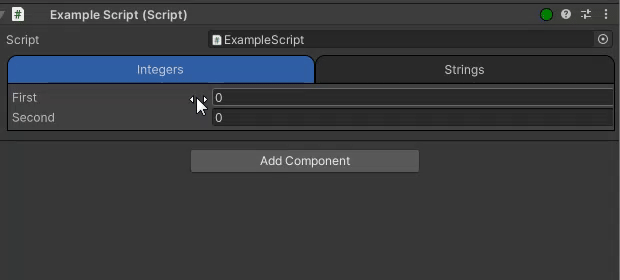
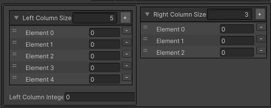
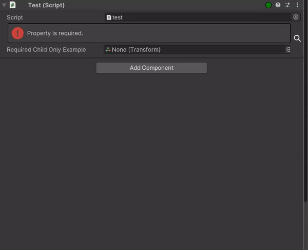
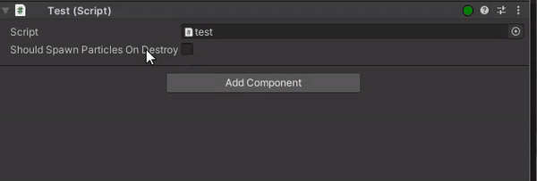
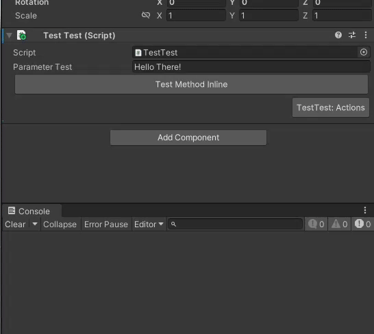
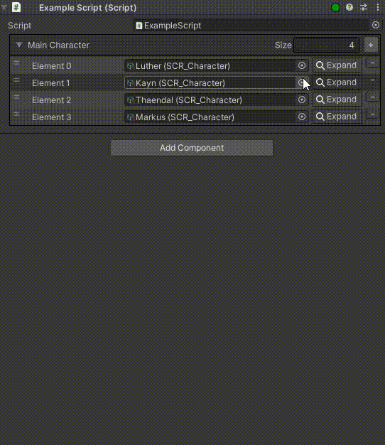
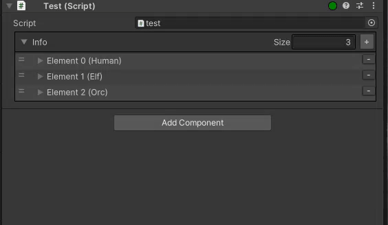
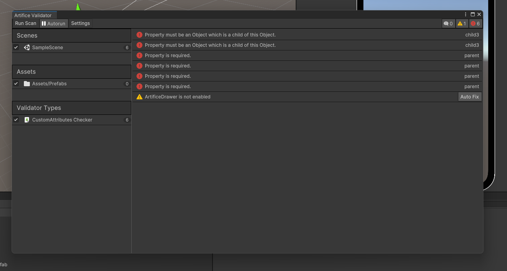

# Artifice Toolkit
Normally, extending Unity’s editor requires specialized knowledge of IMGUI or the UI Toolkit libraries, along with maintaining separate files for each editor extension. This makes the editor's capabilities less accessible and often a hassle to research, learn and develop.

The ArtificeToolkit simplifies this process by providing custom attributes that can be applied directly in the source code, automatically altering the appearance of properties in the editor. The toolkit can be used in a variety of creative ways and can even be extended by creating new attributes.

To demonstrate its usage and effectiveness, see the following MonoBehaviour script's inspector. On the left is the default inspector generated by Unity, and on the right is the same script with a few additional attributes.

<p align="center">
  
</p>

## Why use the ArtificeToolkit?

- Visually "lightweight" inspectors reduce cognitive load by removing unnecessary information.
- A simplified interface helps developers focus on relevant details, minimizing distractions.
- Apply assertions on your serialized fields through validations, to always be sure that certain rules are being followed.


## What is included in the ArtificeToolkit?
The Artifice Toolkit offers three powerful tools:

1. [Artifice Inspector](#artifice-inspector-and-custom-attributes): Alter the appearance of your editor's inspector with simple C# custom attributes. This is editor scripting without the editor scripting knowledge being required!

2. [Artifice Validator](#artifice-validator): Attach validator attributes to your serialized properties to always make sure certain rules are being followed. Do not waste time on absent minded mistakes ever again.

3. [Artifice Drawer](#artifice-drawer): The ArtificeDrawer is what renders everything in the ArtificeToolkit. Invoke the drawer in your Editor Scripts with a SerializedObject or SerializedProperty and you will receive the rendered result of it. This essentially makes the ArtificeDrawer a first-class citizen inspector.

## Unity Version Support
The ArtificeToolkit has been primarily tested and optimized for Unity 2022, ensuring stable and consistent performance. It is also compatible with Unity 2023, where it has been thoroughly tested to maintain functionality. While the toolkit works with Unity 2021, users may encounter occasional warnings; these will be addressed in upcoming updates to improve compatibility with older versions.

## How to Install into Your Unity Project 

You can add the ArtificeToolkit to your Unity project as a package through Git. Follow these steps:
- Navigate to `Window -> Package Manager` in Unity.
- Click the **"+"** icon in the top-left corner of thePackage Manager.
- Select **"Add package from Git URL..."**.
- In the popup that appears, paste the following URL: https://github.com/AbZorbaGames/artificetoolkit.git

<p align="center">
  
</p>

<!-- CUSTOM ATTRIBUTE CATEGORIES AND LINKS -->
# Artifice Inspector and Custom Attributes
By using custom attributes in your MonoBehaviour scripts you can quickly alter the inspector's appearance. In this section, you will find all the attributes which are tested and ready for use.

**NOTE:** By default, the Artifice Drawer is disabled. You can always turn it on/off through the dedicated MenuItem "ArtificeToolkit"

<p align="center">
  
</p>


## Top 3 Recommended Attributes
Following are the simplest to use attributes which can have a big impact on visuals of the inspector.

- [FoldoutGroup](#foldout-group)
- [Required](#required)
- [PreviewScriptable](#previewscriptable)

## Group Attributes
Group Attributes can be used to bring together various properties in a form of a group. Such groups can also work in a nested manner as shown in the [BoxGroup](#boxgroup) example.

- [BoxGroup](#boxgroup)
- [FoldoutGroup](#foldout-group)
- [TabGroup](#tab-group)
- [HorizontalGroup](#horizontal-group)
- [VerticalGroup](#vertical-group)

Note: BoxGroup and FoldoutGroup can be further enhanced using the GroupColor enum.

## Validation Attributes
Validation Attributes are used to assert certain rules over your properties. This is achieved in the inspector visualy using an error prompt, and through the use of the [ArtificeValidator](#artifice-validator).

- [Required](#required)
- [AssetOnly](#assetonly)
- [SceneObjectOnly](#sceneobjectonly)
- [ChildGameObjectOnly](#childgameobjectonly)
- [ValidateInput](#validateinput)
- [ValidateUxml](#validateuxml)
- [ValidateJson](#validatejson)
- [MinValue](#minvalue)
- [MaxValue](#maxvalue)

## Essential and Easy Attributes
These attributes can and should be used frequently. They will at a bare minimum simplify and make the inspector more readable. 

- [Title](#title)
- [EnumToggle](#enumtoggle)
- [EnableIf](#enableif)
- [Button](#button)
- [PreviewSprite](#previewsprite)
- [PreviewScriptable](#previewscriptable)
- [ReadOnly](#readonly)
- [Sort](#sort)

## Miscellaneous
- [ArtificeIgnore](#artificeignore)
- [Space](#space)
- [Range](#range)
- [HideLabel](#hidelabel)
- [HideInArtifice](#hideinartifice)
- [InfoBox](#infobox)
- [ConditionalInfoBox](#conditionalinfobox)
- [ListElementName](#listelementname)
- [MeasureUnit](#measureunit)
- [ForceArtifice](#forceartifice)
- [OnValueChanged](#onvaluechanged)

<!-- WHY ORDER MATTERS -->
## Why Order Matters!
When applying custom attributes to a property, it’s important to understand the order in which they are applied during the rendering process. Internally, custom attributes are applied at the following key rendering points:

1. Pre Property GUI: Before the property is drawn in the Inspector.
2. On Property GUI: Replaces the property’s default GUI entirely.
3. Post Property GUI: Applied after the property is drawn.
4. Wrap Property GUI: Encapsulates all previous steps inside a new container. An example of this is how Group Attributes work.
5. Property Bound GUI: This is called after the property has been drawn, useful when dealing with PropertyField because its children are built lazily in the UI.

For most attributes, the order they are applied follows the order of declaration. However, attributes that use OnWrap GUI (like group attributes) are applied in <b>reverse order</b>, which can lead to unexpected behavior if not handled carefully.

Example
Consider this example with conflicting attributes. Both the BoxGroup and the EnableIf work by utilizing the Wrap Property GUI:
```c#
[SerializeField]
private bool shouldEnable;

[SerializeField, BoxGroup("Test")]
private int x;

[SerializeField, EnableIf(nameof(shouldEnable), true), BoxGroup("Test")]
private int y;
```

If we trace how property 'y' will get rendered, it would firstly resolve the BoxGroup("Test") which has already included property 'x'. Then, it would resolve EnableIf wrapping the BoxGroup inside of the EnableIf.

This is "probably" an undesired effect, unless executed by design. Its wrong, since now the enable if does not encapsulate only the 'y' property, but the entire BoxGroup which holds both 'x' and 'y'.

So the correct version of the above code would be 
```c#
[SerializeField]
private bool shouldEnable;

[SerializeField, BoxGroup("Test")]
private int x;

[SerializeField, BoxGroup("Test"), EnableIf(nameof(shouldEnable), true)]
private int y;
```
In this version, EnableIf is applied first, ensuring that property y behaves as expected—only, and the the BoxGroup is resolved, wrapping the wrapper of the EnableIf.

<!-- ALL ATTRIBUTES DETAILED -->
## All Attributes

<!-- GROUP ATTRIBUTES -->
### BoxGroup
The simplest form of a Group attribute is the BoxGroup. Every serialized property of the script will be rendered inside of a container with the given title.

```c#
[SerializeField, BoxGroup("GroupA")]
private int first;

[SerializeField, BoxGroup("GroupA")]
private int second;

[SerializeField, BoxGroup("GroupA/GroupB")]
private int third;
```  


### Foldout Group
The FoldoutGroup extends the BoxGroup by allowing the user to optionally collapse the container.

```c#
[SerializeField, BoxGroup("GroupExample/GroupA")]
private int first;

[SerializeField, BoxGroup("GroupExample/GroupA")]
private int second;

[SerializeField, FoldoutGroup("GroupExample/GroupB")]
private int third;

[SerializeField, FoldoutGroup("GroupExample/GroupB")]
private int fourth;
```


### Tab Group
The TabGroup allows you to create tabs inside of the Unity inspector. The syntax is more complex than Box and Foldout groups but it is well worth it. The first string dictates the name of the group and the second one dictates the name of the tab. All the properties that belong in the same group and same tab, will be contained together.

```c#
[SerializeField, TabGroup("Example", "Integers")]
private int first;

[SerializeField, TabGroup("Example", "Integers")]
private int second;

[SerializeField, TabGroup("Example", "Strings")]
private string third;

[SerializeField, TabGroup("Example", "Strings")]
private string fourth;

[SerializeField, TabGroup("Example", "Strings")]
private string fifth;
```


### Horizontal Group
The HorizontalGroup attribute allows you to align multiple properties into a single line, instead of having every property be rendered in a new line. Note, that the Horizontal and Vertical groups do not show their titles and are solely used for structuring.

```c#
[SerializeField, HorizontalGroup("horizontal1")]
private List<int> leftColumn;

[SerializeField, HorizontalGroup("horizontal1")]
private List<int> rightColumn;
```


### Vertical Group
The Vertical Group is only useful inside of a horizontal group, to dictate a vertical column of properties inside of it.

```c#
[SerializeField, HorizontalGroup("horizontal1"), VerticalGroup("horizontal1/vertical")]
private List<int> leftColumn;

[SerializeField, HorizontalGroup("horizontal1"), VerticalGroup("horizontal1/vertical")]
private int leftColumnInteger;

[SerializeField, HorizontalGroup("horizontal1")]
private List<int> rightColumn;
```


---

<!-- VALIDATION ATTRIBUTES -->
### Required
The Required field prompts the inspector with an error indicator if the property has not been set. This is GREATLY important in Unity, where it is common to initialize fields and dependencies through [SerializedField] properties. This is what makes the Required field the most important and most commonly used validation attribute.

```c#
[SerializeField, Required] 
private Transform requiredFieldExample;
```


### AssetOnly
AssetOnly validates that the value of the serialized property is an asset. This is useful when you have a field for a prefab that will be potentially instantiated. It is common to drag a GameObject from the scene, instead of the assets.

```c#
[SerializeField, Required, AssetOnly] 
private Transform requiredAssetOnlyExample;
```


### SceneObjectOnly
Works exactly like the [AssetOnly](#assetonly) attribute but in-reverse. This validates that the serialized property value is of an instantiated gameobject in any loaded scene.

```c#
[SerializeField, Required, SceneObjectOnly] 
private Transform requiredSceneOnlyExample;
```


### ChildGameObjectOnly
In Unity, it is also common to have scripts which require references from the children of the GameObject. Use the ChildGameObjectOnly attribute to assert this behaviour. 

In addition, when this attribute is used, the inspector is further enhanced allowing for optimized search of the hierarchy, previewing only the valid GameObjects/Scripts based on the type of the serialized property..

```c#
[SerializeField, Required, ChildGameObjectOnly] 
private Transform requiredChildOnlyExample;
```



### ValidateInput

The ValidateInput attribute allows you to create custom validations on the spot. It can be applied to any attribute, and takes as a parameter the path to some other value (does not have to be serialized). It then validates the value - either that be a field, property or method - and shows your validation message if the return value was false.

```c#
[SerializeField, ValidateInput(nameof(ValidatePeople), "You need to provide at least one person.")] 
private List<Person> people = new();

private bool ValidatePeople()
{
   return people.Any();
}
```


### ValidateUxml

The ValidateUxml attribute is used to validate a string which needs to be in a standard Uxml format. 

### ValidateJson

The ValidateJson attribute is used to validate a string which needs to be in a standard Json format.

---

<!-- EASY AND ESSENTIALS -->
### Title
The Title attribute allows you to highlight a specific part or property of your inspector. It can also be used in combination with the [HideLabel](#hidelabel) to create a new visual representation of fields as shown below.

```c#
[SerializeField, Title("Name")]
private string name;

[SerializeField, Title("Age"), HideLabel, Range(0, 100)]
private int age;

[SerializeField, Title("City"), HideLabel]
private string city;
```


### EnumToggle
EnumToggle converts the conventional for of enum rendering to a multi-button preview. The [Flags] attribute is also supported. Note, that this is useful mostly in enums with a small number of different values.

```c#
public enum Directions
{ 
    Up, Down, Left, Right
}

[SerializeField, EnumToggle] 
private Directions direction;
```


### EnableIf
This attributes allows you to set an equality condition using another field in the same scope to dictate where the target property will be shown or not. This is a really usefull attribute to optionally show properties that depend upon a bool check or enum check. 

```c#
[SerializeField]
private bool shouldSpawnParticlesOnDestroy;

[SerializeField, FoldoutGroup("On Death", GroupColor.Red)]
private ParticleSystem prefabOnDeathParticles;

[SerializeField, FoldoutGroup("On Death", GroupColor.Red)]
private float onDeathDurationSeconds;

[SerializeField, EnableIf(nameof(shouldSpawnParticlesOnDestroy), true), FoldoutGroup("On Death", GroupColor.Red)]
private float onDeathSoundFxVolume;
```



---

**NOTE**: The custom attributes of the Artifice, are processed from last to first. This allows us to perform various tricks since both the EnableIf and the FoldoutGroup, wrap the property in another VisualElement container. By having the EnableIf before the FoldoutGroup, on the LAST instance of the FoldoutGroup, the EnableIf captures the entire FoldoutGroup, although we have only declared it at a single serialized property.

---

### Button
Button allows you to quickly turn any method into a button in the inspector to invoke at your hearts content. Buttons can be placed inline using an optional parameter. Otherwise they will be grouped in a sliding container to keep your inspector clean and simple.

It is worth noting that buttons will always appear last in the rendering order. You can use any of the [GroupAttributes](#BoxGroup) to place the button in ane existing group in the same scope.

```c#
[SerializeField] 
private string parameterTest = "test";

[Button(true)]
private void TestMethod()
{
    Debug.Log("Invoked from editor button!");
}

[Button]
private void TestMethodInline()
{
    Debug.Log("Invoked from editor button!");
}

[Button(true, "parameterTest")]
private void TestMethodWithParameters(string parameter)
{
    Debug.Log($"Invoked from editor button! Dynamic Parameter: {parameter}");
}
```




### PreviewSprite
PreviewSprite works only on the Sprite and Texture2D serialized properties. It renders an enlarged image of the selected value.

```c#
[SerializeField, PreviewSprite] 
private Sprite characterPortrait;
```


### PreviewScriptable
This is one of the most magical attributes in the Artifice Toolkit. It allows you to dynamically instantiate a scriptable object inspector inside of another inspector. This can even work in a nested manner, previewing scriptable objects inside of other scriptable objects etc.

```c#
[CreateAssetMenu(menuName = "ScriptableObject/Character")]
public class SCR_Character : ScriptableObject
{
    [PreviewSprite, HorizontalGroup("row"), HideLabel]
    public Texture2D icon;

    [Title("First Name"), HorizontalGroup("row"), VerticalGroup("col"), HideLabel]
    public string firstName;
        
    [Title("Last Name"), HorizontalGroup("row"), VerticalGroup("col"), HideLabel]
    public string lastName;
}

[SerializeField, PreviewScriptable]
private List<SCR_Character> mainCharacter;
```



---

### ReadOnly

```c#
[SerializeField, ReadOnly] 
private float gravity = 9.81f;

[SerializeField, ReadOnly, ForceArtifice]
private Vector3 up = new Vector3(0f, 1f, 0f);
```


**NOTE**: To make Vector3 and similar structs be readonly, we need to enforce the usage of artifice in their nested properties. This is why, [ForceArtifice](#forceartifice) is used.

---


### Sort

The Sort attribute is used to order fields in the Unity Inspector. It supports inheritance and nested classes. Properties with a lower Sort number have higher priority and appear first in the list. By default, all properties have a sorting value of 0.

```c#
[Serializable]
public class Stats
{
  [Sort(1)]
  public int Damage;
  
  [Sort(0)]
  public int Durability;
}
 
public class Weapon: ScriptableObject
{
  [Sort(3)]
  public Stats Stats;
}

public class Sword: Weapon
{
  [Sort(1)]
  public string Name;
  
  [Sort(2)]
  public string Description;
}
```


**NOTE**: The `Script` name is preserved in the top of the editor.

---


<!-- Miscellaneous -->
### Artifice Ignore
Some classes may not use any custom attribute but are slow on rendering since ArtificeToolkit still needs to check for attributes. In this case, you can apply the `[ArtificeIgnore]` attribute to the MonoBehaviour or ScriptableObject class to have it be rendered with the default IMGUI UI.

**NOTE**: Some classes may come from third-party providers and may not be able to apply the `[ArtificeIgnore]`. In this case, you can add it to the artifice ignore list from the context actions of the inspector. This is a locally stored setting.

### Space
The Space attribute can receive up to four parameters reflecting the margin in pixels you want your element to have from top, bottom, left, right directions.

### Range
The Range attribute works on integers and floats and allows you to control them through a sliding bar. For this, a min and max value are required.

### HideLabel
The HideLabel attribute as the name suggests, finds and dynamically hides the label of the label.

### HideInArtifice
The HideInArtifice label works exactly as the default HideInInspector and does as it suggests. It skips the property from being rendered.

### InfoBox
The InfoBox allows you to add informational or warning prompts to a property. This could be useful for example to document or explain some rules regarding a specific value.

### ConditionalInfoBox
The ConditionalInfoBox allows you to optionally show an InfoBox when some condition is met, in a similar fashion as [EnableIf](#enableif).

### ListElementName
Using this attribute you can append to a list's elements, an extra identifier based on some nested field of the element type. This element can be applied to a list or array only, and the string parameter should match a child property of the element type.

```c#
[Serializable]
public class RaceGeneralInfo
{
    public enum RaceType
    {
        Human,
        Elf,
        Orc
    }
    
    [SerializeField] 
    private RaceType race;
    
    [SerializeField] 
    private int maxAge;

    [SerializeField] 
    private float maxHeight;
}

[ListElementName("race")]
public List<RaceGeneralInfo> info = new();
```



### MeasureUnit
MeasureUnit appends any string passed to it at the right of a property. This can be commonly used to indicate whether a time value is measured in seconds or milliseconds! It can even be used as a self documented part of the code it self.

### MinValue
MinValue asserts a minimum int or float value to the serialized property. 

Note: Currently this only works while the inspector is open. There is nothing stoping the value of going below the minimum value if the inspector is closed.

### MaxValue
As [MinValue](#minvalue) but for a maximum value.

### ForceArtifice
The ArtificeDrawer is responsible for rendering the inspector using VisualElements, applying custom properties when necessary. For optimization, if no custom attributes are detected, it skips the Artifice rendering and falls back to a default IMGUIContainer.

However, there are cases where we might want to enforce the use of Artifice, even for nested properties that don't have custom attributes. In these scenarios, this attribute ensures that Artifice is always used, overriding the default behavior.

### OnValueChanged
OnValueChanged will invoke a specified method as soon as the property's value is changed.

```c#
[SerializeField, OnValueChanged(nameof(TestMethod))] 
private int x;

public void TestMethod()
{
  Debug.Log("test");
}
```

<!-- EXTRA FEATURES -->
## Extra Features
The ArtificeToolkit comes with a lot of extra stuff that will be briefly mentioned here. In the future, more documentation will be added in this section.

1. <b>SerializedDictionary</b>: ArtificeToolkit holds its own serializable dictionary implementation. It can be used and controlled in the inspector with any serializable type.

<div style="display: flex; justify-content: center;">
  
</div>

2. <b>Serialized Interfaces and Abstract Classes</b>: In Artifice, you can use [SerializeReference] and [ForceArtifice] in order to have serialized interface or abstract types in your inspector. Artifice will allow you to select which implementor or inherited type you want, and it will instance the managed reference automatically.
<br><br>**NOTE:** This feature is only supported in Unity 2022 and later. This is caused by the lack of property value tracking for generic types which was added later.  

<div style="flex-direction: row">

```c#
[Serializable]
public abstract class TraitBase
{
   public bool enabled;
   
   public virtual void Update() {}
}

///
/// Inherited classes from TraitBase (Hunger, Health, Energy)
///
```

<div style="display: flex; justify-content: center;">
  
</div>


3. <b>IArtifice_Persistence</b>: In case you need to add persistency to your editor scripts, you can use this interface and implement its methods to support any persisted information. 

4. 4.<b>Artifice_SCR_CommonResourcesHolder</b>: ArtificeToolkit uses icons which are publicly exposed even for other editor tools to utilize.

5. <b>UIBuilder</b>: Dynamically rebuild visual elements using the UIBuilder to have dynamic DOM updates.

6. A plethora of specifalized Artifice_SerializedPropertyExtensions.
 
7. A plethora of Visual Elements like:
    - Artifice_VisualElement_ToggleButton
    - Artifice_VisualElement_FoldoutGroup
    - Artifice_VisualElement_InfoBox

7. You can selectively choose to ignore any C# type by using the "Ignore List" found in the MenuItem "ArtificeToolkit". From there you can search a type and append it into the ignored list. This will cause ArtificeToolkit to fallback to the Unity default rendering system for the specific property. Therefore this feature is for cases where you are experiencing problems with a specific type (e.g. LocalizedString has shown some issues in the past).
<div style="display: flex; justify-content: center;">
  
</div>

<!-- ARTIFICE VALIDATOR -->
# Artifice Validator
The best way to solve bugs, is to avoid creating them. Assertions are one of the most powerful ways to do this and it is considered one of the best programming practices. Using the Artifice Validator, you can apply assertions in your serialized properties.



The Validator works with attributes which inherit from the ValidatorAttribute class. Such attributes have an additional implementation explaining what they are supposed to be asserting. The most common use case the [Required](#required) attribute, to make sure the property has been assigned with a reference.

## Validator in CI or Build scripts
The Artifice_Validator provides the `RunSynchronousValidation` method which returns a List of `ValidatorLog`. This method, will open all scenes contained within the Validator Config file and run the main Validation coroutine on them to gather and return potential logs. 

## Creating new CustomAttributes for your own Validations

Creating your own validations is simple. You need to:

1. **Create a Custom Attribute**  
   Define a custom attribute by inheriting from `ValidatorAttribute`. This attribute encapsulates the logic for what needs to be validated. For example, you might want to ensure a property is required or falls within a specific range.

**NOTE**: By default, when a CustomAttribute is used on an Array or a List, the attribute is injected to the children of the array/list. If you intend your attribute to be applied to he array/list it self, add the `IArtifice_ArrayAppliedAttribute` interface to the attribute in question. 

2. **Implement an Artifice_CustomAttributeDrawer_Validator**  
   Create a drawer class inheriting from `Artifice_CustomAttributeDrawer_Validator_BASE`. This class will define how the validation is performed and how any validation errors or warnings are displayed in the Unity Inspector.

### Example: Required Attribute

Below is an example of how to implement a "Required" attribute to ensure that a property has been assigned a reference.

```csharp
[Artifice_CustomAttributeDrawer(typeof(RequiredAttribute))]
public class Artifice_CustomAttributeDrawer_RequiredAttribute : Artifice_CustomAttributeDrawer_Validator_BASE
{
    public override string LogMessage { get; } = "Property is required.";
    public override Sprite LogSprite { get; } = Artifice_SCR_CommonResourcesHolder.instance.ErrorIcon;
    public override LogType LogType { get; } = LogType.Error;

    // Determine if this validator applies to the given property
    protected override bool IsApplicableToProperty(SerializedProperty property)
    {
        return property.propertyType == SerializedPropertyType.ObjectReference;
    }

    // Validate the property
    public override bool IsValid(SerializedProperty property)
    {
        return property.objectReferenceValue != null;
    }
}
```


<!-- ARTIFICE DRAWER -->
# Artifice Drawer
The ArtificeDrawer is what renders everything when the Artifice Inspector is enabled. The ArtificeDrawer can receive a SerializedObject or SerializedProperty and returns a VisualElement of the rendered result. It essentially parses the SerializedObject or SerializedProperty and renders either the default result or the enhanced result if CustomAttributes have been used on that property.

This section will only interest you if you want to learn the underlying secrets of how the ArtificeToolkit works at its core and learn how to extend it with your own CustomAttributes and tools. Knowledge regarding CustomEditors, CustomPropertyDrawers etc will be needed.

## ArtificeDrawer GUI Steps
When a property directly uses a CustomAttribute, the drawer will access the respective [CustomAttributeDrawer](#custom-attribute-drawer) and call its GUI steps in order

  1. Pre GUI: Appends a VisualElement before the property.
  2. On GUI: Replaces the property with the result of this method. Only applies with IsReplacingProperty is set on true.
  3. Post GUI: Appends a VisualElement after the property.
  4. Wrap GUI: Returns a new VisualElement which adds the VisualElements from the previous steps inside of it.
  5. On Bound Property GUI: Executes code when the OnGUI VisualElement is attached in the inspector.


## Creating New CustomAttributes

To create a new `CustomAttribute`, follow these steps:

1. **YourCustomAttribute**: Create your custom attribute by inheriting from `System.Attribute`. This should be placed in a **runtime** folder so it can be applied to your components or ScriptableObjects.
   
2. **Artifice_CustomAttributeDrawer_YourAttribute**: Create a custom attribute drawer by inheriting from `Artifice_CustomAttributeDrawer`. This drawer class must be placed inside an **Editor** folder.

   To link the attribute with its drawer, mark the drawer class with `[CustomPropertyDrawer(typeof(YourAttribute))]`.

### Example: `TitleAttribute`

In this example, we create a custom `TitleAttribute` that adds a styled header to serialized fields in the Unity Inspector.

### Step 1: Create the `TitleAttribute`

Create the `TitleAttribute` in a **runtime** folder. This attribute takes a string title, which will be used as a label in the Inspector.

```csharp
using System;
using UnityEngine;

[AttributeUsage(AttributeTargets.Field, Inherited = true, AllowMultiple = false)]
public class TitleAttribute : CustomAttribute
{
    public string Title { get; }

    public TitleAttribute(string title)
    {
        Title = title;
    }
}
```

### Step 2: Create the CustomDrawer
Now, create a custom drawer for the TitleAttribute in an Editor folder. This drawer will display the title as a label in the Unity Inspector.

```c#
using UnityEditor;
using UnityEngine.UIElements;
using ArtificeToolkit.Editor.Artifice_CustomAttributeDrawers;

[CustomPropertyDrawer(typeof(TitleAttribute))]
public class Artifice_CustomAttributeDrawer_Title : Artifice_CustomAttributeDrawer
{
    private TitleAttribute _titleAttribute;

    // Initialize the TitleAttribute
    public Artifice_CustomAttributeDrawer_Title()
    {
        _titleAttribute = (TitleAttribute)Attribute;
    }

    // Override to insert the custom label before the property field
    public override VisualElement OnPrePropertyGUI(SerializedProperty property)
    {
        // Create a label using the title from the attribute
        return new Label(_titleAttribute.Title)
        {
            style =
            {
                unityFontStyleAndWeight = FontStyle.Bold,
                fontSize = 14,
                color = Color.white
            }
        };
    }
}
```

How to Use:
You can now use the TitleAttribute in any of your MonoBehaviour or ScriptableObject classes to add custom headers to your serialized fields:

```c#
using UnityEngine;

public class ExampleComponent : MonoBehaviour
{
    [Title("Player Settings")]
    public float health;

    [Title("Weapon Settings")]
    public int ammoCount;
}

```

## Known Issues
- In Unity 2021.x.x the following warning may appear due to value tracking not working generic types of serialized properties.
```
Serialized property type Generic does not support value tracking; callback is not set for characters
UnityEditor.RetainedMode:UpdateSchedulers ()
```

- Copying an entire Artifice List requires both lists to be alive when the Paste happens. This will be fixed in the future. 

- The ArtificeToolkit was created with Dark Theme is mind and is currently the only supported color palette.
